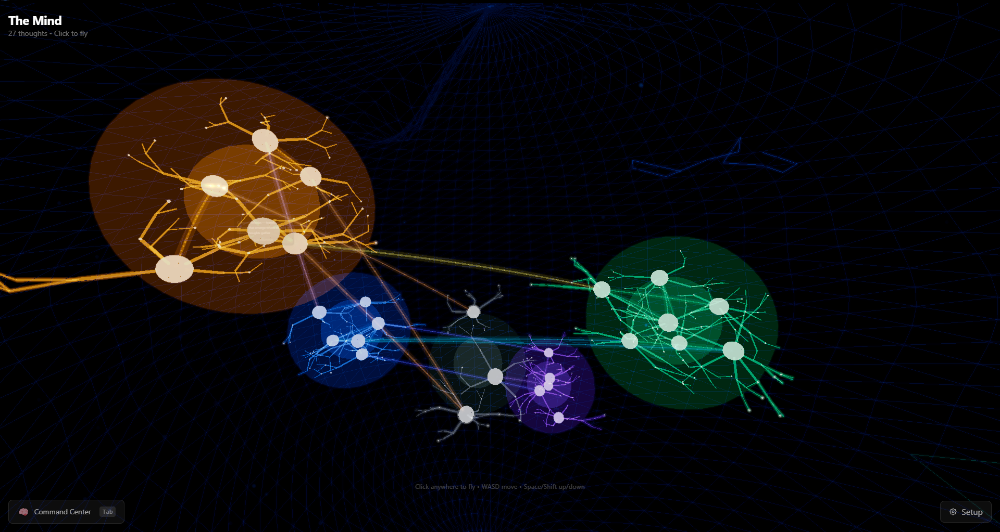
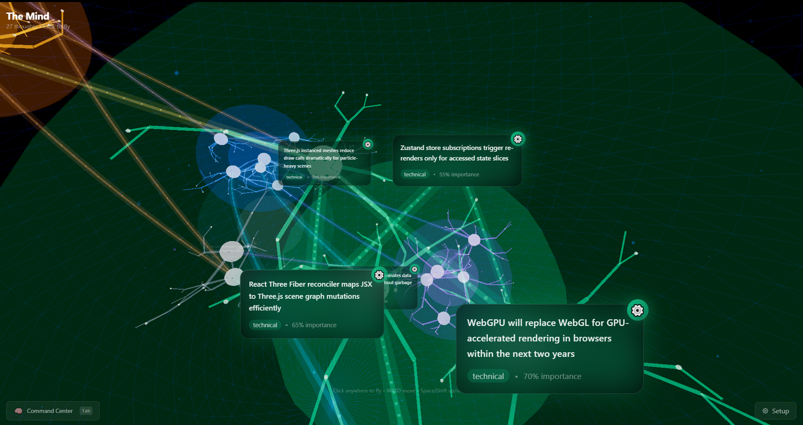
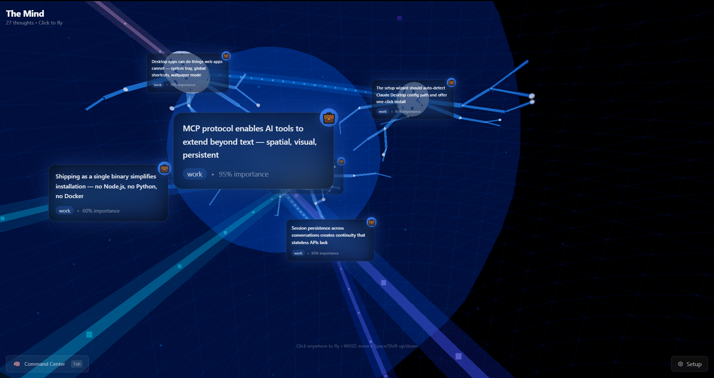
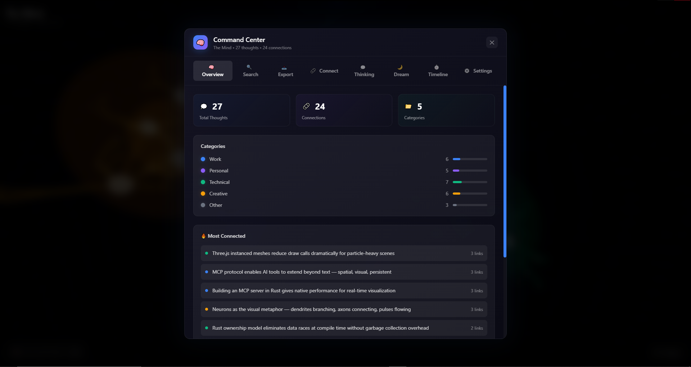

# The Mind

A 3D spatial visualization of AI thought. Thoughts appear as neuron nodes, connections form neural pathways, and clusters emerge as ideas accumulate. Built with Tauri, React Three Fiber, and SQLite.

Connects to AI clients via MCP (Model Context Protocol). The AI logs thoughts as it works — The Mind renders them in real-time in a flyable 3D space.



## Requirements

- [Node.js](https://nodejs.org/) 18+
- [Rust](https://rustup.rs/) (stable)
- [Tauri CLI](https://v2.tauri.app/start/prerequisites/)

## Setup

```bash
# Install dependencies
npm install

# Run in development
npm run tauri dev

# Build for production
npm run tauri build
```

The built executable and installer will be in `src-tauri/target/release/bundle/`.

## MCP Configuration

Add to your Claude Desktop config (`%APPDATA%\Claude\claude_desktop_config.json`):

```json
{
  "mcpServers": {
    "the-mind": {
      "command": "C:/path/to/the-mind.exe"
    }
  }
}
```

The app includes a setup wizard that generates this config for you.

## Controls

| Input | Action |
|-------|--------|
| Click | Enter FPS mode |
| WASD | Move |
| Mouse | Look |
| Space / Shift | Up / Down |
| Click (on thought) | Open detail panel |
| Tab | Command Center |
| Escape | Close overlay |
| F10 | Toggle wallpaper mode |

## Screenshots

Fly into a cluster to see thought panels with content, category, and importance:





Command Center provides search, stats, MCP setup, timeline, and settings:



## Optional: session-forge

The Mind optionally integrates with [session-forge](https://github.com/420247jake/session-forge), an MCP tool that tracks session journals, architectural decisions, and debugging dead ends across conversations. When session-forge data is detected on your system, thought detail panels will show related context — past sessions, decisions, and lessons learned that match the thought you're inspecting.

Not required. The Mind works fully on its own. session-forge just adds cross-session context when available.

```bash
npx session-forge
```

## Project Structure

```
src/                        Frontend (React + Three.js)
  components/               3D scene, UI panels, effects
  stores/                   Zustand state (mind, dream, timeline, etc.)
  hooks/                    Database sync
  types.ts                  Shared TypeScript types

src-tauri/src/              Backend (Rust)
  main.rs                   Tauri app entry + commands
  database.rs               SQLite operations
  mcp_server.rs             MCP protocol handler (stdio)
  session_forge.rs          session-forge integration
  wallpaper.rs              Desktop wallpaper system
  utils.rs                  Shared utilities
```

## License

MIT
